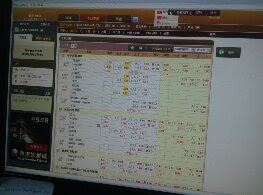
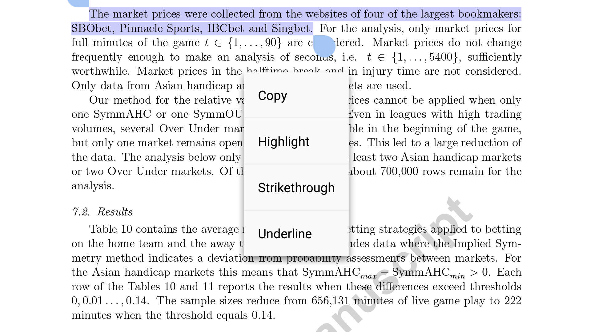
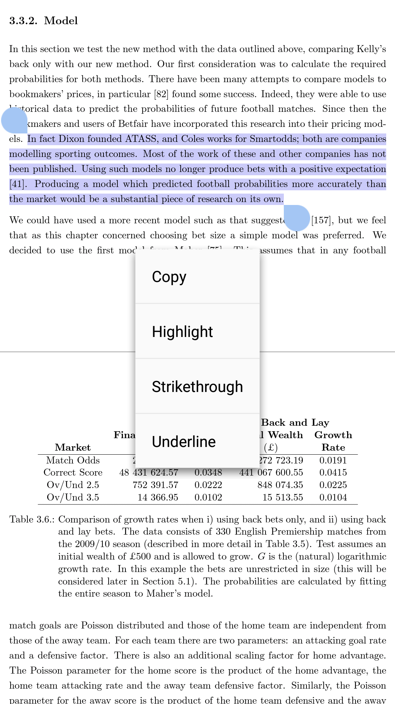
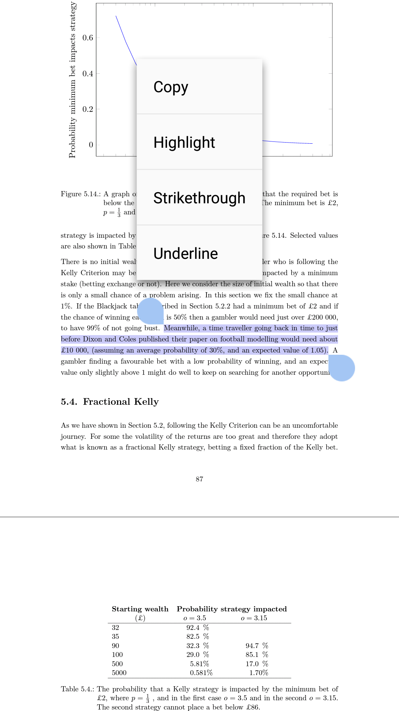
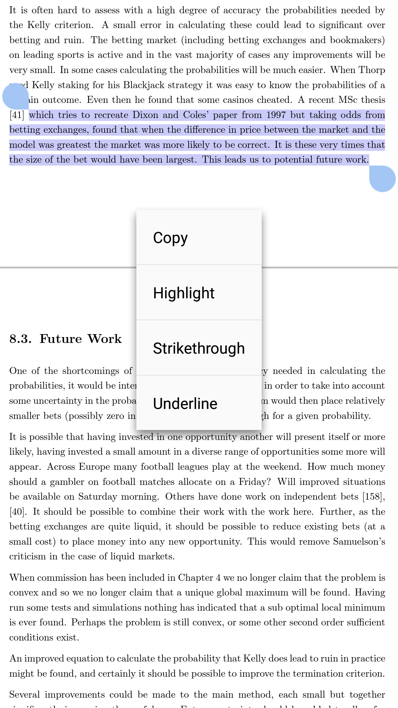

```{r setup, message=FALSE, warning=FALSE}
suppressPackageStartupMessages(library('BBmisc'))
#'@ suppressPackageStartupMessages(library('rmsfuns'))

pkgs <- c('knitr', 'kableExtra', 'devtools', 'lubridate', 'data.table', 'qrmtools', 'tidyquant', 'plyr', 'stringr', 'magrittr', 'dplyr', 'tidyverse', 'tidyr', 'highcharter', 'formattable', 'DT', 'recharts', 'fmsb', 'radarchart', 'rvest', 'XML', 'RCurl')

suppressAll(lib(pkgs))
#'@ load_pkg(pkgs)

#'@ funs <- c('')
#'@ l_ply(funs, function(x) source(paste0('./function/', x)))
#'@ install_github('mwang27/recharts')
source('https://raw.githubusercontent.com/mwang27/recharts/master/R/echartR.R')

options(warn = -1)
rm(pkgs)
```

# 始めに

小さいから、三国志が大好きい。ある日は[说英雄谁是英雄之光荣三国](http://xccds1977.blogspot.com/2013/08/blog-post_26.html)のみて、今日は賭け屋（ブックメーカー）の評価レーダー妖怪図を描きます。

# データ

*Bookmakers ranking*^[[参考文献]に読みます。]から、賭け屋の情報を采集しました。あのうウェブはサッカ.リーグ.ランキングみたいです。

```{r, message=FALSE, warning=FALSE}
lnk <- 'http://www.bookmakersranking.com/bookmakers_ranking'

dfm <- lnk %>% 
    getURL %>% 
    htmlParse %>% 
    readHTMLTable %>% 
    .[[1]]

names(dfm) <- paste0(c('', 'Bookmaker', 'logo', 'Betting offer', 'Bookmakers margin', 'Alexa Popularity', 'User rating', 'rewards', 'Our Assassment', 'Change points according to the last settlement', 'Final assassment', 'reviews'), '_', as.character(unlist(head(dfm, 1))))
dfm %<>% .[-1, -c(1, 3, 12)] %>% 
  as_data_frame

dfm[,-c(1, 8:9)] %<>% mutate_if(is.factor, as.character) %>% 
    mutate_if(is.character, as.numeric)
dfm[,8:9] %<>% mutate(
    `Change points according to the last settlement_1 month` = 
        str_replace_all(`Change points according to the last settlement_1 month`, ' pts.', ''), 
    `Final assassment_max 100` = 
        str_replace_all(`Final assassment_max 100`, ' pts.', '')) %>% 
    mutate_if(is.character, as.numeric)
names(dfm)[1] <- 'Bookmaker'
dfm %<>% mutate(Bookmaker = str_replace_all(Bookmaker, 'Bonus .{0,}', ''))

dfm %>% datatable(filter = 'top', 
                  caption = htmltools::tags$caption(
                    style = 'caption-side: bottom; text-align: center;', 
                    'Table 2.1: ', htmltools::em('Bookmakers rating.')), 
                  extensions = list('Scroller', 'FixedColumns'), options = list(
                    deferRender = TRUE, scrollY = 200, scroller = TRUE, 
                    dom = 't', scrollX = TRUE, fixedColumns = TRUE))
```

# データ可視化

## 賭け屋一覧

*Radar Chart Example*からの`recharts::echartR()`採用する。

```{r, message=FALSE, warning=FALSE}
dfm2 <- dfm %>% gather(cat, value, -Bookmaker)
dfm2 %<>% mutate_if(is.character, as.factor)

## need to convert to data.frame class, otherwise will be error.
dfm2 %>% data.frame %>% 
  recharts::echartR(x= ~cat, y= ~value, series= ~Bookmaker, type='radarfill', 
                    symbolList='none', #palette=c('firebrick1','dodgerblue'), 
                    title='Bookmaker Rating', subtitle= '(by @englianhu)')
```

## 評価一覧

*radarchart*からの`radarchart::chartJSRadar()`採用する。

```{r, message=FALSE, warning=FALSE}
chartJSRadar(dfm, main = 'Bookmakers Rating', maxScale = 10, showToolTipLabel=TRUE)
```

# 賭け屋

## サッカ.リーグ一覧


かスポはうちのもと賭け屋。





```{r, message=FALSE, warning=FALSE}
scdt <- readRDS('data/report.rds')
```

```{r, message=FALSE, warning=FALSE, eval=FALSE}
#-------- eval=FALSE --------
scdt[[1]] %>% tryCatch({
  ddply(.(Month, League), summarise, 
        Turnover = sum(Turnover, na.rm = TRUE), 
        Ticket = sum(Ticket, na.rm = TRUE), 
        Comp_Turn = sum(Comp_Turn, na.rm = TRUE), 
        PL = sum(PL, na.rm = TRUE)) %>% tbl_df}, 
  error = function(e) NULL)

scdt[[2]] %>% tryCatch({
  ddply(.(Month, League), summarise, 
        Turnover = sum(Turnover, na.rm = TRUE), 
        Ticket = sum(Ticket, na.rm = TRUE), 
        Comp_Turn = sum(Comp_Turn, na.rm = TRUE), 
        PL = sum(PL, na.rm = TRUE)) %>% tbl_df}, 
  error = function(e) NULL)
```

## 賭け産品一覧

```{r, message=FALSE, warning=FALSE}
scdt[[1]] %>% ddply(.(Bet_Type), summarise, 
#scdt[[1]] %>% ddply(.(Month, Bet_Type), summarise, 
               Turnover = sum(Turnover, na.rm = TRUE), 
               Ticket = sum(Ticket, na.rm = TRUE), 
               Comp_Turn = sum(Comp_Turn, na.rm = TRUE), 
               PL = sum(PL, na.rm = TRUE)) %>% tbl_df %>% 
  kable(caption = 'SB1') %>% 
  kable_styling(bootstrap_options = c('striped', 'hover', 'condensed', 'responsive'))

scdt[[2]] %>% ddply(.(Bet_Type), summarise, 
#scdt[[2]] %>% ddply(.(Month, Bet_Type), summarise, 
               Turnover = sum(Turnover, na.rm = TRUE), 
               Ticket = sum(Ticket, na.rm = TRUE), 
               Comp_Turn = sum(Comp_Turn, na.rm = TRUE), 
               PL = sum(PL, na.rm = TRUE)) %>% tbl_df %>% 
  kable(caption = 'SB2') %>% 
  kable_styling(bootstrap_options = c('striped', 'hover', 'condensed', 'responsive'))
```

カンボジアから帰ったん、ある日数学と量化交易の文献が探して参考したいんですが、全ての文献とデータが壊れた。以下は僕のもと会社のレポット（あのサッカ.リーグと月も、陰陽師が潰した。）。

```{r, echo=FALSE, message=FALSE, warning=FALSE}
scdt[[1]][,-c(1:3)] %>% 
  colSums(na.rm=TRUE) %>% t %>% 
  as_data_frame %>% 
  mutate(Rate = formattable::percent(PL/Comp_Turn)) %>% 
  kable(caption = 'SB1 9 months Report (from Sep 2006 to Jun 2007)') %>% 
  kable_styling(bootstrap_options = c('striped', 'hover', 'condensed', 'responsive'))

scdt[[2]][,-c(1:3)] %>% 
  colSums(na.rm=TRUE) %>% t %>% 
  as_data_frame %>% 
  mutate(Rate = formattable::percent(PL/Comp_Turn)) %>% 
  kable(caption = 'SB2 9 months Report (from Sep 2006 to Jun 2007)') %>% 
  kable_styling(bootstrap_options = c('striped', 'hover', 'condensed', 'responsive'))

```

# 量化交易のスポーツ.ヘッジファンド

あの英国やアメリカや色々な外国人、量化交易のスポーツ.ヘッジファンド[Betting Strategy and Model Validation](https://github.com/scibrokes/betting-strategy-and-model-validation)数学で賭ける、いつまでも利益を得る。







何年前から、僕は量化交易の研究[Rmodel](https://github.com/englianhu/Rmodel)が終わった、あの研究文献先日ある試合[Bookdown contest submission: Odds Modelling and Testing Inefficiency of Sports Bookmakers](https://community.rstudio.com/t/bookdown-contest-submission-odds-modelling-and-testing-inefficiency-of-sports-bookmakers/13889)を参加すた。

Rプログラミングを支える、毎日のTシャツを着て、もし量化交易も気に入るなら、[RProgramming.net Store](https://www.cafepress.com/rprogrammingnet)に連絡する。


# 終わりに

[Analyse the Finance and Stocks Price of Bookmakers](https://github.com/scibrokes/analyse-the-finance-and-stocks-price-of-bookmakers)で色々な賭け屋を分析します。

```{r option, echo = FALSE}
## Set options back to original options
options(warn = 0)
```

# 付録

## 文献情報 

うちの文献情報、ご覧でください。

- 文献作成日: 2018-09-11
- 文献最終更新日: `r today('Asia/Tokyo')`
- `r R.version.string`
- R 版本 (省略): `r getRversion()`
- [**rmarkdown** 包み](https://github.com/rstudio/rmarkdown) version: `r packageVersion('rmarkdown')`
- 文献版本: 1.0.1
- 作者: [®γσ, Eng Lian Hu](https://beta.rstudioconnect.com/content/3091/ryo-eng.html)
- ギットハブ: [Source Code](https://github.com/scibrokes/analyse-the-finance-and-stocks-price-of-bookmakers)
- ほかの情報:

```{r info, echo=FALSE, warning=FALSE, results='asis'}
suppressMessages(require('dplyr', quietly = TRUE))
suppressMessages(require('formattable', quietly = TRUE))
suppressMessages(require('knitr', quietly = TRUE))
suppressMessages(require('kableExtra', quietly = TRUE))

sys1 <- devtools::session_info()$platform %>% 
  unlist %>% data.frame(Category = names(.), session_info = .)
rownames(sys1) <- NULL

sys1 %<>% rbind(., data.frame(
  Category = 'Current time', 
  session_info = paste(as.character(lubridate::now('Asia/Tokyo')), 'JST'))) %>% 
  dplyr::filter(Category != 'os')

sys2 <- data.frame(Sys.info()) %>% mutate(Category = rownames(.)) %>% .[2:1]
names(sys2)[2] <- c('Sys.info')
rownames(sys2) <- NULL

cbind(sys1, sys2) %>% 
  kable(caption = 'Additional session information:') %>% 
  kable_styling(bootstrap_options = c('striped', 'hover', 'condensed', 'responsive'))

rm(sys1, sys2)
```

## 参考文献

01. [Radar Charts in R](https://plot.ly/r/radar-chart)
02. [Radar Chart Example](https://rpubs.com/omicsdata/radarchart)
03. [radarchart {fmsb}](http://minato.sip21c.org/msb/man/radarchart.html)
04. [Holdings Channel](https://www.holdingschannel.com/all/)
05. [The Optimal Size of Hedge Funds](https://corpgov.law.harvard.edu/2016/06/14/the-optimal-size-of-hedge-funds/)
06. [World's Top 10 Hedge Fund Firms](https://www.investopedia.com/articles/personal-finance/011515/worlds-top-10-hedge-fund-firms.asp)
07. [Institutional Investor](https://www.institutionalinvestor.com/)
08. [radarchart](https://rdrr.io/cran/radarchart/f/README.md)
09. [Bookmakers ranking](http://www.bookmakersranking.com/bookmakers_ranking)

---

** [Scibrokes®](http://www.scibrokes.com)個人経営企業の知的財産権**
